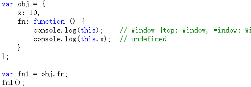

深入理解javascript原型和闭包（10）——this
this的取值，分四种情况。我们来挨个看一下。
在此再强调一遍一个非常重要的知识点：在函数中this到底取何值，是在函数真正被调用执行的时候确定的，函数定义的时候确定不了。因为this的取值是执行上下文环境的一部分，每次调用函数，都会产生一个新的执行上下文环境。
情况1：构造函数
所谓构造函数就是用来new对象的函数。其实严格来说，所有的函数都可以new一个对象，但是有些函数的定义是为了new一个对象，而有些函数则不是。另外注意，构造函数的函数名第一个字母大写（规则约定）。例如：Object、Array、Function等。

以上代码中，如果函数作为构造函数用，那么其中的this就代表它即将new出来的对象。
注意，以上仅限new Foo()的情况，即Foo函数作为构造函数的情况。如果直接调用Foo函数，而不是new Foo()，情况就大不一样了。

这种情况下this是window，我们后文中会说到。

要补充的内容是，在构造函数的prototype中，this代表着什么。
 
如上代码，在Fn.prototype.getName函数中，this指向的是f1对象。因此可以通过this.name获取f1.name的值。

其实，不仅仅是构造函数的prototype，即便是在整个原型链中，this代表的也都是当前对象的值。

情况2：函数作为对象的一个属性

如果函数作为对象的一个属性时，并且作为对象的一个属性被调用时，函数中的this指向该对象。

以上代码中，fn不仅作为一个对象的一个属性，而且的确是作为对象的一个属性被调用。结果this就是obj对象。

注意，如果fn函数不作为obj的一个属性被调用，会是什么结果呢？

如上代码，如果fn函数被赋值到了另一个变量中，并没有作为obj的一个属性被调用，那么this的值就是window，this.x为undefined。

情况3：函数用call或者apply调用

当一个函数被call和apply调用时，this的值就取传入的对象的值。至于call和apply如何使用，不会的朋友可以去查查其他资料，本系列教程不做讲解。

情况4：全局 & 调用普通函数

在全局环境下，this永远是window，这个应该没有非议。

普通函数在调用时，其中的this也都是window。

不过下面的情况你需要注意一下：

函数f虽然是在obj.fn内部定义的，但是它仍然是一个普通的函数，this仍然指向window。

完了。

看到了吧，this有关的知识点还是挺多的，不仅多而且非常重要。

最后，既然提到了this，有必要把一个非常经典的案例介绍给大家，又是jQuery源码的。

以上代码是从jQuery中摘除来的部分代码。jQuery.extend和jQuery.fn.extend都指向了同一个函数，但是当执行时，函数中的this是不一样的。

执行jQuery.extend(…)时，this指向jQuery；执行jQuery.fn.extend(…)时，this指向jQuery.fn。

这样就巧妙的将一段代码同时共享给两个功能使用，更加符合设计原则。

