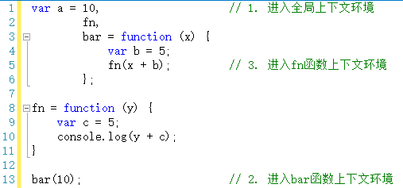

深入理解javascript原型和闭包（11）——执行上下文栈
执行全局代码时，会产生一个执行上下文环境，每次调用函数都又会产生执行上下文环境。当函数调用完成时，这个上下文环境以及其中的数据都会被消除，再重新回到全局上下文环境。处于活动状态的执行上下文环境只有一个。

其实这是一个压栈出栈的过程——执行上下文栈。如下图：

可根据以下代码来详细介绍上下文栈的压栈、出栈过程。

如上代码。

在执行代码之前，首先将创建全局上下文环境。
|全局上下文环境||
|---|---|
|a|undefined|
|fn|undefined|
|bar|undefined|
|this|window|
然后是代码执行。代码执行到第12行之前，上下文环境中的变量都在执行过程中被赋值。
|全局上下文环境||
|---|---|
|a|10|
|fn|function|
|bar|function|
|this|window|
执行到第13行，调用bar函数。
跳转到bar函数内部，执行函数体语句之前，会创建一个新的执行上下文环境。
|bar函数-执行上下文环境||
|---|---|
|b|undefined|
|x|10|
|arguments|[10]|
|this|window|
并将这个执行上下文环境压栈，设置为活动状态。

执行到第5行，又调用了fn函数。进入fn函数，在执行函数体语句之前，会创建fn函数的执行上下文环境，并压栈，设置为活动状态。
 
待第5行执行完毕，即fn函数执行完毕后，此次调用fn所生成的上下文环境出栈，并且被销毁（已经用完了，就要及时销毁，释放内存）。
 
同理，待第13行执行完毕，即bar函数执行完毕后，调用bar函数所生成的上下文环境出栈，并且被销毁（已经用完了，就要及时销毁，释放内存）。
 

好了，我很耐心的给大家介绍了一段简短代码的执行上下文环境的变化过程，一个完整的闭环。其中上下文环境的变量赋值过程我省略了许多，因为那些并不难，一看就知道。

讲到这里，我不得不很遗憾的跟大家说：其实以上我们所演示的是一种比较理想的情况。有一种情况，而且是很常用的一种情况，无法做到这样干净利落的说销毁就销毁。这种情况就是伟大的——闭包。

要说闭包，咱们还得先从自由变量和作用域说起。