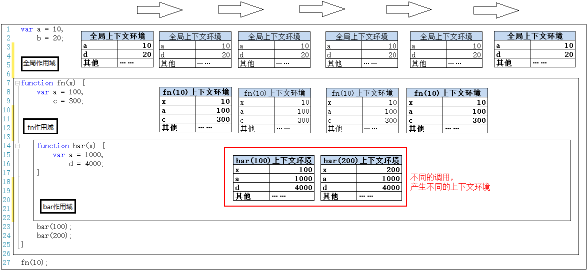
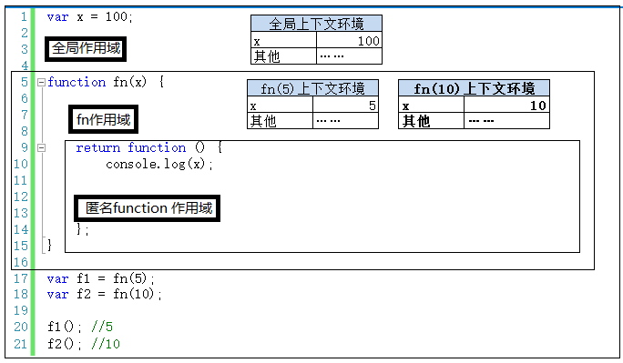

深入理解javascript原型和闭包（13）-【作用域】和【上下文环境】
上文简单介绍了作用域，本文把作用域和上下文环境结合起来说一下，会理解的更深一些。
 
如上图，我们在上文中已经介绍了，除了全局作用域之外，每个函数都会创建自己的作用域，作用域在函数定义时就已经确定了。而不是在函数调用时确定。

下面我们将按照程序执行的顺序，一步一步把各个上下文环境加上。另外，对上下文环境不了解的朋友，可以去看看之前的两篇文章：

第一步，在加载程序时，已经确定了全局上下文环境，并随着程序的执行而对变量就行赋值。
 
第二步，程序执行到第27行，调用fn(10)，此时生成此次调用fn函数时的上下文环境，压栈，并将此上下文环境设置为活动状态。
 
第三步，执行到第23行时，调用bar(100)，生成此次调用的上下文环境，压栈，并设置为活动状态。
 
第四步，执行完第23行，bar(100)调用完成。则bar(100)上下文环境被销毁。接着执行第24行，调用bar(200)，则又生成bar(200)的上下文环境，压栈，设置为活动状态。
 
第五步，执行完第24行，则bar(200)调用结束，其上下文环境被销毁。此时会回到fn(10)上下文环境，变为活动状态。
 
第六步，执行完第27行代码，fn(10)执行完成之后，fn(10)上下文环境被销毁，全局上下文环境又回到活动状态。
 
结束了。像老太太的裹脚布——又臭又长！
最后我们可以把以上这几个图片连接起来看看。
 
连接起来看，还是挺有意思的。作用域只是一个“地盘”，一个抽象的概念，其中没有变量。要通过作用域对应的执行上下文环境来获取变量的值。同一个作用域下，不同的调用会产生不同的执行上下文环境，继而产生不同的变量的值。所以，作用域中变量的值是在执行过程中产生的确定的，而作用域却是在函数创建时就确定了。

所以，如果要查找一个作用域下某个变量的值，就需要找到这个作用域对应的执行上下文环境，再在其中寻找变量的值。

虽然本文很长，但是文字较少，图片居多，图片都有形象的展示，大家花十几分钟也能慢慢看完。但是，这节内容真的很重要。

以上代码中，咱们还没有设计到跨作用域取值的情况，即——自由变量。详细内容且听下回分解。

有些人反映这两个是一回儿事。本文就用一个小例子来说明一下，作用域和上下文环境绝对不是一回事儿。
00 上下文环境：

可以理解为一个看不见摸不着的对象（有若干个属性），虽然看不见摸不着，但确实实实在在存在的，因为所有的变量都在里面存储着，要不然咱们定义的变量在哪里存？

另外，对于函数来说，上下文环境是在调用时创建的，这个很好理解。拿参数做例子，你不调用函数，我哪儿知道你要给我传什么参数？

01 作用域：

首先，它很抽象。第二，记住一句话：除了全局作用域，只有函数才能创建作用域。创建一个函数就创建了一个作用域，无论你调用不调用，函数只要创建了，它就有独立的作用域，就有自己的一个“地盘”。

02 两者：

一个作用域下可能包含若干个上下文环境。有可能从来没有过上下文环境（函数从来就没有被调用过）；有可能有过，现在函数被调用完毕后，上下文环境被销毁了；有可能同时存在一个或多个（闭包）。
上面的文字不理解没关系，且看下面的例子。

第一，除了全局作用域外，每个函数都要创建一个作用域。作用域之间的变量是相互独立的。因此，全局作用域中的x和fn作用域中的x，两者毫无关系，互不影响，和平相处。
 
第二，程序执行之前，会生成全局上下文环境，并在程序执行时，对其中的变量赋值。
 
第三，程序执行到第17行，调用fn(5)，会产生fn(5)的上下文环境，并压栈，并设置为活动状态。
 
第四，执行完第17行，fn(5)的返回值赋值给了f1。此时执行上下文环境又重新回到全局，但是fn(5)的上下文环境不能就此销毁，因为其中有闭包的引用（可翻看前面文章，此处不再赘述）。
 
第五，继续执行第18行，再次调用fn函数——fn(10)。产生fn(5)的上下文环境，并压栈，并设置为活动状态。但是此时fn(5)的上下文环境还在内存中——一个作用域下同时存在两个上下文环境。

 

