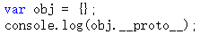
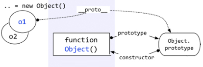
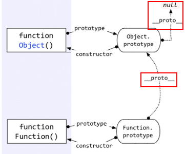

深入理解javascript原型和闭包（4）——隐式原型
$\color{#f90}{每个函数function都有一个prototype}$，即原型。这里再加一句话——$\color{#f90}{每个对象都有一个\_\_proto\_\_}$，可成为隐式原型。
这个`__proto__`是一个隐藏的属性，javascript不希望开发者用到这个属性值，有的低版本浏览器甚至不支持这个属性值。所以你在Visual Studio 2012这样很高级很智能的编辑器中，都不会有`__proto__`的智能提示，但是你不用管它，直接写出来就是了。

 

上面截图看来，obj.`__proto__`和Object.prototype的属性一样！这么巧！

答案就是一样。
obj这个对象本质上是被Object函数创建的，因此obj.`__proto__`=== Object.prototype。我们可以用一个图来表示。

即，$\color{#f90}{每个对象都有一个\_\_proto\_\_属性，指向创建该对象的函数的prototype}$。

那么上图中的“Object prototype”也是一个对象，它的__proto__指向哪里？

好问题！
在说明“Object prototype”之前，先说一下自定义函数的prototype。自定义函数的prototype本质上就是和 var obj = {} 是一样的，都是被Object创建，所以它的__proto__指向的就是Object.prototype。
但是$\color{#f80}{Object.prototype确实一个特例——它的\_\_proto\_\_指向的是null，切记切记！}$

还有——函数也是一种对象，函数也有__proto__吗？
又一个好问题！——当然有。
函数也不是从石头缝里蹦出来的，函数也是被创建出来的。谁创建了函数呢？——Function——注意这个大写的“F”。

且看如下代码。

 
以上代码中，第一种方式是比较传统的函数创建方式，第二种是用new Functoin创建。
首先根本不推荐用第二种方式。
这里只是向大家演示，函数是被Function创建的。
对象的__proto__指向的是创建它的函数的prototype，就会出现：Object.__proto__ === Function.prototype。用一个图来表示。

上图中，很明显的标出了：自定义函数Foo.__proto__指向Function.prototype，Object.__proto__指向Function.prototype，唉，怎么还有一个……Function.__proto__指向Function.prototype？这不成了循环引用了？

对！是一个环形结构。
其实稍微想一下就明白了。Function也是一个函数，函数是一种对象，也有__proto__属性。既然是函数，那么它一定是被Function创建。所以——Function是被自身创建的。所以它的__proto__指向了自身的Prototype。

最后一个问题：Function.prototype指向的对象，它的__proto__是不是也指向Object.prototype？

答案是肯定的。因为Function.prototype指向的对象也是一个普通的被Object创建的对象，所以也遵循基本的规则。

 
