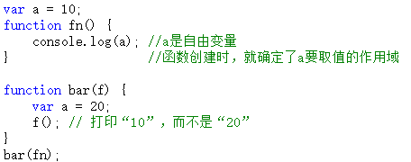

深入理解javascript原型和闭包（9）——简述【执行上下文】下
上一篇我们讲到在全局环境下的代码段中，执行上下文环境中有如何数据：
	变量、函数表达式——变量声明，默认赋值为undefined；
	this——赋值；
	函数声明——赋值； 
如果在函数中，除了以上数据之外，还会有其他数据。先看以下代码：

以上代码展示了在函数体的语句执行之前，arguments变量和函数的参数都已经被赋值。从这里可以看出，函数每被调用一次，都会产生一个新的执行上下文环境。因为不同的调用可能就会有不同的参数。

另外一点不同在于，函数在定义的时候（不是调用的时候），就已经确定了函数体内部自由变量的作用域。至于“自由变量”和“作用域”是后面要专门拿出来讲述的重点，这里就先点到为止。用一个例子说明一下：

 
好了，总结完了函数的附加内容，我们就此要全面总结一下上下文环境的数据内容。

全局代码的上下文环境数据内容为：
|  表头   | 表头  |
|  ----  | ----  |
| 普通变量（包括函数表达式），如： var a = 10; | 声明（默认赋值为undefined） |
| 函数声明，如： function fn() { }  | 赋值 |
|this|赋值|
如果代码段是函数体，那么在此基础上需要附加：
|  表头   | 表头  |
|  ----  | ----  |
| 参数  | 赋值 |
| arguments  | 赋值 |
| 自由变量的取值作用域  | 赋值 |

给执行上下文环境下一个通俗的定义——在执行代码之前，把将要用到的所有的变量都事先拿出来，有的直接赋值了，有的先用undefined占个空。

了解了执行上下文环境中的数据信息，你就不用再去死记硬背那些可恶的面试题了。理解了就不用背诵！

讲完了上下文环境，又来了新的问题——在执行js代码时，会有数不清的函数调用次数，会产生许多个上下文环境。这么多上下文环境该如何管理，以及如何销毁而释放内存呢？下一节将通过“执行上下文栈”来解释这个问题。

不过别着急，在解释“执行上下文栈”之前，还需要把this说一下，this还是挺重要的。说完this，接着说执行上下文栈。