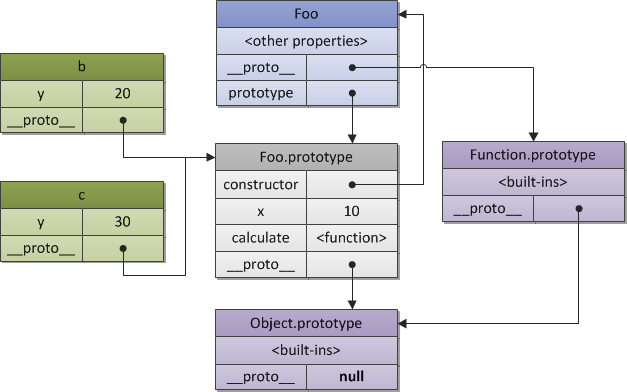

1. **实例的 `__proto__` === 构造函数的prototype**
2. **构造函数的 `__proto__` === Function.prototye**
3. **构造函数原型(Array.prototype)的 `__proto__` === Object.prototype(对象的原型)**
4. **`Object.prototype.__proto__` === null;**

let a = new Foo();
let b = new Foo();
a继承了Foo的原型链

## 知识点
- 每个函数都有一个属性叫做 `prototype` ，这个 `prototype` 的属性值是一个对象（属性的集合，再次强调！），默认的只有一个叫做 `constructor` 的属性，指向这个函数本身。
  + **Foo.prototype.constructor = Foo;**
  + Foo.prototype是一个对象，那么他是被对象的构造函数创建的，so，对象的__proto__指向构造函数Object创建出来的prototype，即 **`Foo.prototype.__proto__ === Object.prototype`**
- 每个对象都有一个隐藏的属性：`__proto__`，这个属性引用了创建这个对象的函数的prototype。即：`fn.__proto__ === Fn.prototype`
  + **`a.__proto__ === Foo.prototype;`**
  + **可以通过这种方式实现原型链的继承** （发布-订阅模式）
    - `Driver.prototype.__proto__ = EventEmiter.prototype`
    - Object.prototype确实一个特例——它的__proto__指向的是null`Object.prototype.__proto__ === null`
- 那么第三个问题来了，**既然对象是函数来创建的，对象.`__proto__ `===(指向) 创建对象的函数的prototype, 那么函数Function的__prototy__,还有构建对象的Object函数等等，这个函数的__proto__又指向哪儿呢** ，
  + 没错,函数也是对象，他也是被函数Function自身创建出来的，那么顺便的Function.prototype也是对象，是被Object函数创建出来的，那么`Function.prototype.__proto__` 指向（===）Object.prototype;
- **Object.prototype.`__proto__` === null**