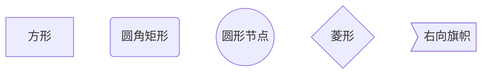

## 段落
末尾两个空格加换行

## 标题
> 不用#表示的标题：
```markdown
我展示的是一级标题
=================

我展示的是二级标题
-----------------
```
我展示的是一级标题
=================

我展示的是二级标题
-----------------

## 缩进和换行
缩进：`&nbsp;&ensp;&emsp;`

1. 半角的空格：
`&ensp; 或 &#8194;`
2. 全角的空格：
`&emsp; 或 &#8195;`
3. 不断行的空格：
`&nbsp; 或 &#160;`

换行：`<br>`

## font
<font face="黑体">黑体</font>

<font face="微软雅黑">微软雅黑</font>

<font face="STCAIYUN">华为彩云</font>

<font color=#ff2222 size=7 face="黑体">最大号红色字体</font>

<font color=#00ffff size=7>#00ffff颜色</font>

<font color=gray size=7>gray颜色</font>

<table><tr><td bgcolor=orange> 背景色是 1 orange</td></tr></table>

<table><tr><td bgcolor= BlueViolet > 背景色2 BlueViolet </td></tr></table>

<table><tr><td bgcolor=#7FFFD4>这里的背景色是：Aquamarine，  十六进制颜色值：#7FFFD4， rgb(127, 255, 212)</td></tr></table>

## 给文字添加颜色
$\color{#4285f4}{G}
\color{#ea4335}{o}
\color{#fbbc05}{o}
\color{#4285f4}{g}
\color{#34a853}{l}
\color{#ea4335}{e}$

$\color{#FF0000}{红}$ $\color{#FF7D00}{橙}$ $\color{#fff03d}{黄}$ $\color{#00FF00}{绿}$  $\color{#0000FF}{蓝}$ $\color{#00FFFF}{靛}$ $\color{#FF00FF}{紫}$

$\color{#FF0000}{红-f00}$ 
$\color{#ff8038}{橙-ff8038}$ 
$\color{#fff03d}{黄-ff0}$ 
$\color{#2dab00}{绿-2dab00}$  
$\color{#0000FF}{蓝-00f}$ 
$\color{#2dabff}{靛-2dabff}$ 
$\color{#FF00FF}{紫=f0f}$
>如果语句里有_，需要\来进行转义

## 标签
使用 <kbd>Ctrl</kbd>+<kbd>Alt</kbd>+<kbd>Del</kbd> 重启电脑
Markdown<sup>注释</sup><sub>下标</sub>
Markdown

## 表格
|  表头右对齐   | 表头左对齐  |  表头居中显示 |
|  ----:  | :----  | :----:  |
| 单元格  | 单元格 |  单元格 |
| 单元格  | 单元格 |  单元格 |

## 分割线
---
***

## 删除线
~~删除~~

## 下划线
<u>下划线</u>

## 脚注
Markdown[^FOOTER]
[^FOOTER]:不常用的展示

## 流程图
### 图形样式
|表述|	说明	|含义|
|--|--|-|
|id[文字]|矩形结点	|表示过程，及整个过程的一个环节|
|id(文字)|圆角矩形节点	|表示开始和结束|
|id((文字))	|圆形节点	|表示连接，为避免流程交叉，可将流程切开成对|
|id{文字}	|菱形节点	|表示判断、决策|
|id>文字]	|右向旗帜状结点|

### 链接符号


1. 横向流程图源码格式：

2. 竖向流程图源码格式：

3. 标准流程图源码格式：

```flow
st=>start: 开始框
op=>operation: 处理框
cond=>condition: 判断框(是或否?)
sub1=>subroutine: 子流程
io=>inputoutput: 输入输出框
e=>end: 结束框
st->op->cond
cond(yes)->io->e
cond(no)->sub1(right)->op
```
4. 标准流程图源码格式（横向）：

```flow
st=>start: 开始框
op=>operation: 处理框
cond=>condition: 判断框(是或否?)
sub1=>subroutine: 子流程
io=>inputoutput: 输入输出框
e=>end: 结束框
st(right)->op(right)->cond
cond(yes)->io(bottom)->e
cond(no)->sub1(right)->op
```
5. UML时序图源码样例：

```sequence
对象A->对象B: 对象B你好吗?（请求）
Note right of 对象B: 对象B的描述
Note left of 对象A: 对象A的描述(提示)
对象B-->对象A: 我很好(响应)
对象A->对象B: 你真的好吗？
```
6. UML时序图源码复杂样例：

```sequence
Title: 标题：复杂使用
对象A->对象B: 对象B你好吗?（请求）
Note right of 对象B: 对象B的描述
Note left of 对象A: 对象A的描述(提示)
对象B-->对象A: 我很好(响应)
对象B->小三: 你好吗
小三-->>对象A: 对象B找我了
对象A->对象B: 你真的好吗？
Note over 小三,对象B: 我们是朋友
participant C
Note right of C: 没人陪我玩
```
7. UML标准时序图样例：


8. 甘特图样例：
