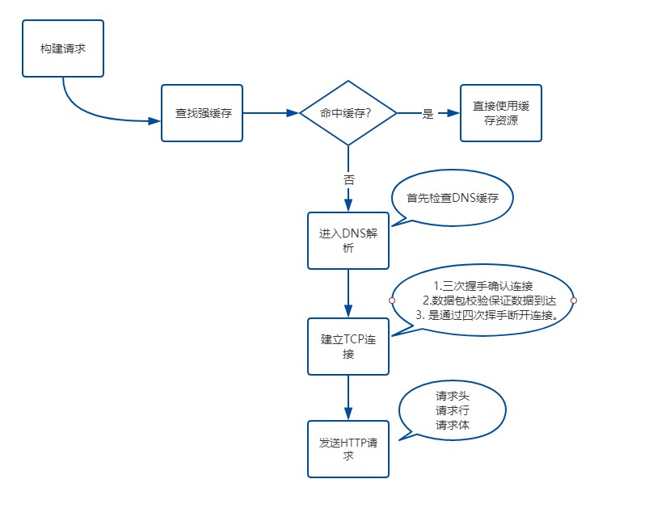

# 从输入URL到页面呈现发生了什么？——网络篇
本文来源：[三元博客-001 从输入URL到页面呈现发生了什么？——网络篇](https://sanyuan0704.top/my_blog/blogs/browser/browser-render/001.html#%E7%BD%91%E7%BB%9C%E8%AF%B7%E6%B1%82)

这是一个可以无限难的问题。出这个题目的目的就是为了考察你的 web 基础深入到什么程度。由于水平和篇幅有限，在这里我将把其中一些重要的过程给大家梳理一遍，相信能在绝大部分的情况下给出一个比较惊艳的答案。

这里我提前声明，由于是一个综合性非常强的问题，可能会在某一个点上深挖出非常多的细节，我个人觉得学习是一个循序渐进的过程，在明白了整体过程后再去自己研究这些细节，会对整个知识体系有更深的理解。同时，关于延申出来的细节点我都有参考资料，看完这篇之后不妨再去深入学习一下，扩展知识面。

好，正题开始。

此时此刻，你在浏览器地址栏输入了百度的网址:

    https://www.baidu.com/

## 网络请求

### 1. 构建请求
浏览器会构建请求行:

    // 请求方法是GET，路径为根路径，HTTP协议版本为1.1
    GET / HTTP/1.1

### 2. 查找强缓存
先检查强缓存，如果命中直接使用，否则进入下一步。关于强缓存，如果不清楚可以参考上一篇文章。

### 3. DNS解析
由于我们输入的是域名，而数据包是通过IP地址传给对方的。因此我们需要得到域名对应的IP地址。这个过程需要依赖一个服务系统，这个系统将域名和 IP 一一映射，我们将这个系统就叫做DNS（域名系统）。得到具体 IP 的过程就是DNS解析。

当然，值得注意的是，浏览器提供了DNS数据缓存功能。即如果一个域名已经解析过，那会把解析的结果缓存下来，下次处理直接走缓存，不需要经过 DNS解析。

另外，如果不指定端口的话，默认采用对应的 IP 的 80 端口。

### 4. 建立 TCP 连接
这里要提醒一点，Chrome 在同一个域名下要求同时最多只能有 6 个 TCP 连接，超过 6 个的话剩下的请求就得等待。

假设现在不需要等待，我们进入了 TCP 连接的建立阶段。首先解释一下什么是 TCP:

>TCP（Transmission Control Protocol，传输控制协议）是一种面向连接的、可靠的、基于字节流的传输层通信协议。

建立 TCP连接经历了下面三个阶段:

1. 通过三次握手(即总共发送3个数据包确认已经建立连接)建立客户端和服务器之间的连接。
2. 进行数据传输。这里有一个重要的机制，就是接收方接收到数据包后必须要向发送方确认, 如果发送方没有接到这个确认的消息，就判定为数据包丢失，并重新发送该数据包。当然，发送的过程中还有一个优化策略，就是把大的数据包拆成一个个小包，依次传输到接收方，接收方按照这个小包的顺序把它们组装成完整数据包。
3. 断开连接的阶段。数据传输完成，现在要断开连接了，通过四次挥手来断开连接。

读到这里，你应该明白 TCP 连接通过什么手段来保证数据传输的可靠性，一是三次握手确认连接，二是数据包校验保证数据到达接收方，三是通过四次挥手断开连接。

当然，如果再深入地问，比如为什么要三次握手，两次不行吗？第三次握手失败了怎么办？为什么要四次挥手等等这一系列的问题，涉及计算机网络的基础知识，比较底层，但是也是非常重要的细节，希望你能好好研究一下，另外这里有一篇不错的文章，点击进入相应的推荐文章，相信这篇文章能给你启发。

### 5.发送 HTTP 请求
现在TCP连接建立完毕，浏览器可以和服务器开始通信，即开始发送 HTTP 请求。浏览器发 HTTP 请求要携带三样东西:请求行、请求头和请求体。

首先，浏览器会向服务器发送请求行,关于请求行， 我们在这一部分的第一步就构建完了，贴一下内容:

    // 请求方法是GET，路径为根路径，HTTP协议版本为1.1
    GET / HTTP/1.1

结构很简单，由请求方法、请求URI和HTTP版本协议组成。

同时也要带上请求头，比如我们之前说的Cache-Control、If-Modified-Since、If-None-Match都由可能被放入请求头中作为缓存的标识信息。当然了还有一些其他的属性，列举如下:

    Accept: */*
    Accept-Language: zh-CN,zh;q=0.9,en;q=0.8,en-GB;q=0.7,en-US;q=0.6
    Accept-Encoding: gzip, deflate
    Cache-Control: no-cache
    Connection: keep-alive
    Host: 192.168.162.26:9527
    Origin: http://localhost:9527
    Pragma: no-cache
    Referer: http://localhost:9527/
    User-Agent: Mozilla/5.0 (Windows NT 10.0; Win64; x64) AppleWebKit/537.36 (KHTML, like Gecko) Chrome/89.0.4389.82 Safari/537.36 Edg/89.0.774.50

最后是请求体，请求体只有在POST方法下存在，常见的场景是表单提交。

## 网络响应
HTTP 请求到达服务器，服务器进行对应的处理。最后要把数据传给浏览器，也就是返回网络响应。

跟请求部分类似，网络响应具有三个部分:响应行、响应头和响应体。

响应行类似下面这样:

    HTTP/1.1 200 OK

由HTTP协议版本、状态码和状态描述组成。

响应头包含了服务器及其返回数据的一些信息, 服务器生成数据的时间、返回的数据类型以及对即将写入的Cookie信息。

举例如下:

    Cache-Control: no-cache
    Connection: keep-alive
    Content-Encoding: gzip
    Content-Type: text/html;charset=utf-8
    Date: Wed, 04 Dec 2019 12:29:13 GMT
    Server: apache
    Set-Cookie: rsv_i=f9a0SIItKqzv7kqgAAgphbGyRts3RwTg%2FLyU3Y5Eh5LwyfOOrAsvdezbay0QqkDqFZ0DfQXby4wXKT8Au8O7ZT9UuMsBq2k; path=/; domain=.baidu.com

响应完成之后怎么办？TCP 连接就断开了吗？

不一定。这时候要判断Connection字段, 如果请求头或响应头中包含Connection: Keep-Alive，表示建立了持久连接，这样TCP连接会一直保持，之后请求统一站点的资源会复用这个连接。

否则断开TCP连接, 请求-响应流程结束。

## 总结
到此，我们来总结一下主要内容，也就是浏览器端的网络请求过程：
<!-- 
```flow
st=>start: 开始框
op=>operation: 处理框
cond=>condition: 判断框(是或否?)
sub1=>subroutine: 子流程
io=>inputoutput: 输入输出框
e=>end: 结束框
st->op->cond
cond(yes)->io->e
cond(no)->sub1(right)->op
``` -->

