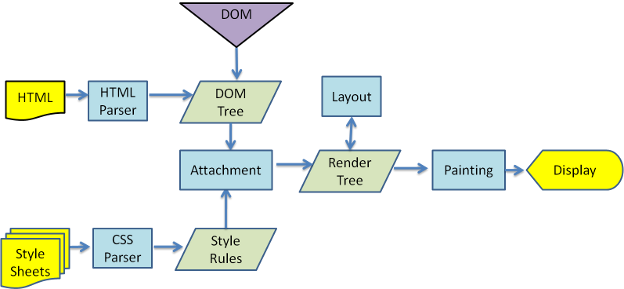
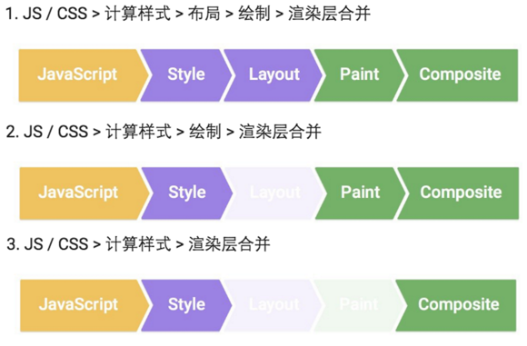

# 梳理浏览器渲染流程
[页面地址](https://segmentfault.com/a/1190000014520786)
首先简单了解一下浏览器请求、加载、渲染一个页面的大致过程：

+ DNS 查询
+ TCP 连接
+ HTTP 请求即响应
+ 服务器响应
+ 客户端渲染

这里主要将客户端渲染展开梳理一下，从浏览器器内核拿到内容（渲染线程接收请求，加载网页并渲染网页），渲染大概可以划分成以下几个步骤：

+ 解析html建立dom树
+ 解析css构建render树（将CSS代码解析成树形的数据结构，然后结合DOM合并成render树）
+ 布局render树（Layout/reflow），负责各元素尺寸、位置的计算
+ 绘制render树（paint），绘制页面像素信息
+ 浏览器会将各层的信息发送给GPU（GPU进程：最多一个，用于3D绘制等），GPU会将各层合成（composite），显示在屏幕上。
参考一张图（webkit渲染主要流程）：

这里先解释一下几个概念，方便大家理解：

* DOM Tree：浏览器将HTML解析成树形的数据结构。

* CSS Rule Tree：浏览器将CSS解析成树形的数据结构。

* Render Tree: DOM和CSSOM合并后生成Render Tree。

* layout: 有了Render Tree，浏览器已经能知道网页中有哪些节点、各个节点的CSS定义以及他们的从属关系，从而去计算出每个节点在屏幕中的位置。

* painting: 按照算出来的规则，通过显卡，把内容画到屏幕上。

* reflow（回流）：当浏览器发现某个部分发生了点变化影响了布局，需要倒回去重新渲染，内行称这个回退的过程叫 reflow。reflow 会从 <html> 这个 root frame 开始递归往下，依次计算所有的结点几何尺寸和位置。reflow 几乎是无法避免的。现在界面上流行的一些效果，比如树状目录的折叠、展开（实质上是元素的显 示与隐藏）等，都将引起浏览器的 reflow。鼠标滑过、点击……只要这些行为引起了页面上某些元素的占位面积、定位方式、边距等属性的变化，都会引起它内部、周围甚至整个页面的重新渲 染。通常我们都无法预估浏览器到底会 reflow 哪一部分的代码，它们都彼此相互影响着。

* repaint（重绘）：改变某个元素的背景色、文字颜色、边框颜色等等不影响它周围或内部布局的属性时，屏幕的一部分要重画，但是元素的几何尺寸没有变。

注意：

1. display:none 的节点不会被加入Render Tree，而visibility: hidden
则会，所以，如果某个节点最开始是不显示的，设为display:none是更优的。
2. display:none 会触发 reflow，而 visibility:hidden 只会触发 repaint，因为没有发现位置变化。
3. 有些情况下，比如修改了元素的样式，浏览器并不会立刻reflow 或 repaint 一次，而是会把这样的操作积攒一批，然后做一次reflow，这又叫异步 reflow 或增量异步 reflow。但是在有些情况下，比如resize窗口，改变了页面默认的字体等。对于这些操作，浏览器会马上进行 reflow。

再参考一张图理解一下：

细致分离两个环节，其他环节参考上述概念注解：

**JavaScript**：JavaScript实现动画效果，DOM元素操作等。
**Composite（渲染层合并）**：对页面中 DOM 元素的绘制是在多个层上进行的。在每个层上完成绘制过程之后，浏览器会将所有层按照合理的顺序合并成一个图层，然后显示在屏幕上。对于有位置重叠的元素的页面，这个过程尤其重要，因为一旦图层的合并顺序出错，将会导致元素显示异常。

在实际场景下，大致会出现三种常见的渲染流程（Layout和Paint步骤是可避免的，可参考上一张图的注意部分理解）：

