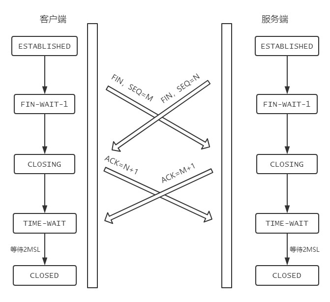

# 003 TCP 四次挥手的过程
## 过程拆解

刚开始双方处于ESTABLISHED状态。

客户端要断开了，向服务器发送 FIN 报文，在 TCP 报文中的位置如下图:

发送后客户端变成了FIN-WAIT-1状态。注意, 这时候客户端同时也变成了half-close(半关闭)状态，即无法向服务端发送报文，只能接收。

服务端接收后向客户端确认，变成了CLOSED-WAIT状态。

客户端接收到了服务端的确认，变成了FIN-WAIT2状态。

随后，服务端向客户端发送FIN，自己进入LAST-ACK状态，

客户端收到服务端发来的FIN后，自己变成了TIME-WAIT状态，然后发送 ACK 给服务端。

注意了，这个时候，客户端需要等待足够长的时间，具体来说，是 2 个 MSL(Maximum Segment Lifetime，报文最大生存时间), 在这段时间内如果客户端没有收到服务端的重发请求，那么表示 ACK 成功到达，挥手结束，否则客户端重发 ACK。

## 等待2MSL的意义

如果不等待会怎样？

如果不等待，客户端直接跑路，当服务端还有很多数据包要给客户端发，且还在路上的时候，若客户端的端口此时刚好被新的应用占用，那么就接收到了无用数据包，造成数据包混乱。所以，最保险的做法是等服务器发来的数据包都死翘翘再启动新的应用。

那，照这样说一个 MSL 不就不够了吗，为什么要等待 2 MSL?

1 个 MSL 确保四次挥手中主动关闭方最后的 ACK 报文最终能达到对端
1 个 MSL 确保对端没有收到 ACK 重传的 FIN 报文可以到达
这就是等待 2MSL 的意义。

## 为什么是四次挥手而不是三次？
因为服务端在接收到FIN, 往往不会立即返回FIN, 必须等到服务端所有的报文都发送完毕了，才能发FIN。因此先发一个ACK表示已经收到客户端的FIN，延迟一段时间才发FIN。这就造成了四次挥手。

如果是三次挥手会有什么问题？

等于说服务端将ACK和FIN的发送合并为一次挥手，这个时候长时间的延迟可能会导致客户端误以为FIN没有到达客户端，从而让客户端不断的重发FIN。

## 同时关闭会怎样？

如果客户端和服务端同时发送 FIN ，状态会如何变化？如图所示:

