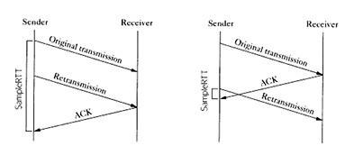

## 007 TCP报文中时间戳的作用有哪些？

timestamp是 TCP 报文首部的一个可选项，一共占 10 个字节，格式如下:

    kind(1 字节) + length(1 字节) + info(8 个字节)

其中 kind = 8， length = 10， info 有两部分构成: timestamp和timestamp echo，各占 4 个字节。

那么这些字段都是干嘛的呢？它们用来解决那些问题？

接下来我们就来一一梳理，TCP 的时间戳主要解决两大问题:

+ 计算往返时延 RTT(Round-Trip Time)
+ 防止序列号的回绕问题

### 计算往返时延 RTT
在没有时间戳的时候，计算 RTT 会遇到的问题如下图所示:

如果以第一次发包为开始时间的话，就会出现左图的问题，RTT 明显偏大，开始时间应该采用第二次的；

如果以第二次发包为开始时间的话，就会导致右图的问题，RTT 明显偏小，开始时间应该采用第一次发包的。

实际上无论开始时间以第一次发包还是第二次发包为准，都是不准确的。

那这个时候引入时间戳就很好的解决了这个问题。

比如现在 a 向 b 发送一个报文 s1，b 向 a 回复一个含 ACK 的报文 s2 那么：

+ step 1: a 向 b 发送的时候，timestamp 中存放的内容就是 a 主机发送时的内核时刻 ta1。
+ step 2: b 向 a 回复 s2 报文的时候，timestamp 中存放的是 b 主机的时刻 tb, timestamp echo字段为从 s1 报文中解析出来的 ta1。
+ step 3: a 收到 b 的 s2 报文之后，此时 a 主机的内核时刻是 ta2, 而在 s2 报文中的 timestamp echo 选项中可以得到 ta1, 也就是 s2 对应的报文最初的发送时刻。然后直接采用 ta2 - ta1 就得到了 RTT 的值。

### 防止序列号回绕问题
现在我们来模拟一下这个问题。

序列号的范围其实是在0 ~ 2 ^ 32 - 1, 为了方便演示，我们缩小一下这个区间，假设范围是 0 ~ 4，那么到达 4 的时候会回到 0。

| 第几次发包 | 发送字节 | 对应序列号 | 状态 |
| :---------: | :---------: | :----------: | :----------: |
| 1	| 0 ~ 1 | 0 ~ 1	| 成功接收 |
| 2	| 1 ~ 2 | 1 ~ 2	| 滞留在网络中 |
| 3	| 2 ~ 3 | 2 ~ 3	| 成功接收 |
| 4	| 3 ~ 4 | 3 ~ 4	| 成功接收 |
| 5	| 4 ~ 5 | 0 ~ 1	| 成功接收，序列号从0开始 |
| 6	| 5 ~ 6 | 1 ~ 2	| ？？？ |

假设在第 6 次的时候，之前还滞留在网路中的包回来了，那么就有两个序列号为1 ~ 2的数据包了，怎么区分谁是谁呢？这个时候就产生了序列号回绕的问题。

那么用 timestamp 就能很好地解决这个问题，因为每次发包的时候都是将发包机器当时的内核时间记录在报文中，那么两次发包序列号即使相同，时间戳也不可能相同，这样就能够区分开两个数据包了。